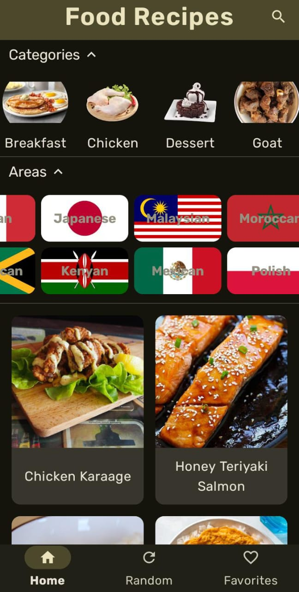
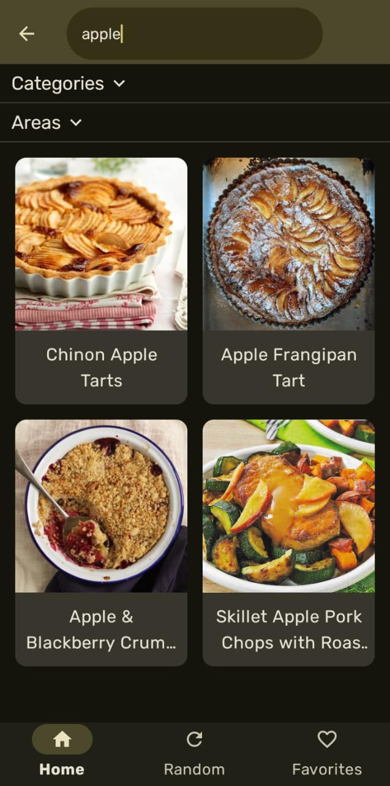
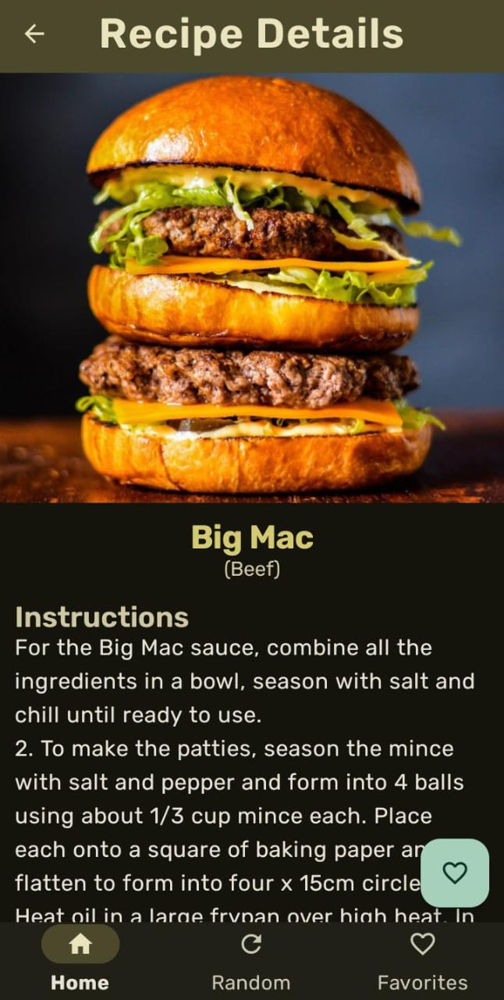
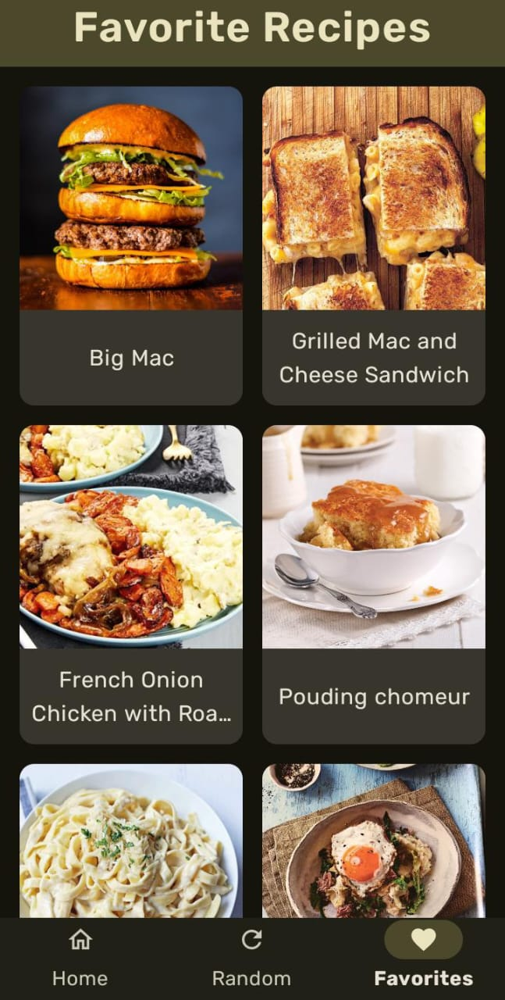
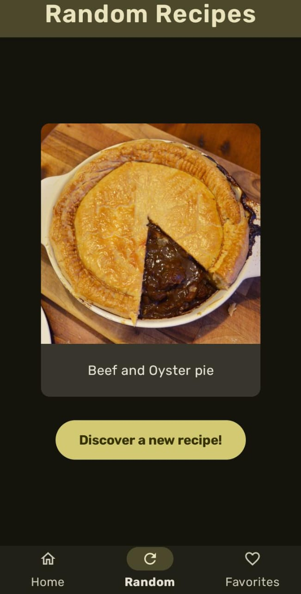

# 🍽️ FoodRecipes

**FoodRecipes** is an Android application built with **Jetpack Compose** that allows users to browse, search, and save recipes from around the world. It connects to an external food API to fetch recipes by name, category, and area, and stores favorite recipes locally using Room.

  

---

## ✨ Features

- 🔎 **Search recipes by name** using the top bar.
- 🌍 **Filter recipes** by category and area (country of origin).
- 🧾 **View recipe details**, including ingredients and instructions.
- ❤️ **Save favorite recipes** to local storage using Room.
- 🎲 **Discover random recipes** with a single tap.
- 💾 **Offline access to favorites** using local database.
- 🧪 Built with **MVVM architecture**, dependency injection, and unit tests.

---

## 🛠️ Tech Stack

| Layer           | Libraries / Tools                              |
|----------------|--------------------------------------------------|
| UI             | Jetpack Compose, Material 3                      |
| Architecture   | MVVM, ViewModel                                 |
| Networking     | Retrofit, Kotlin Serialization, OkHttp          |
| Dependency Injection | Hilt (Dagger Hilt)                        |
| Image Loading  | Coil                                             |
| Local Storage  | Room (SQLite)                                   |
| Testing        | JUnit, MockK, Coroutines Test, Core Testing     |

---

## 🧩 Screens

### 🏠 Home Screen
- Filter by **categories** (e.g., Chicken, Dessert).
- Filter by **area** (e.g., Mexican, Japanese).
- Use the **search bar** to find recipes by name.

### 📄 Details Screen
- Shows full recipe details.
- Includes a **Floating Action Button** to mark as favorite.
- Saves recipe in local database when favorited.

### ❤️ Favorites Screen
- Displays saved recipes from local storage (Room DB).

### 🎲 Random Screen
- Shows a random recipe with a button to fetch another.

